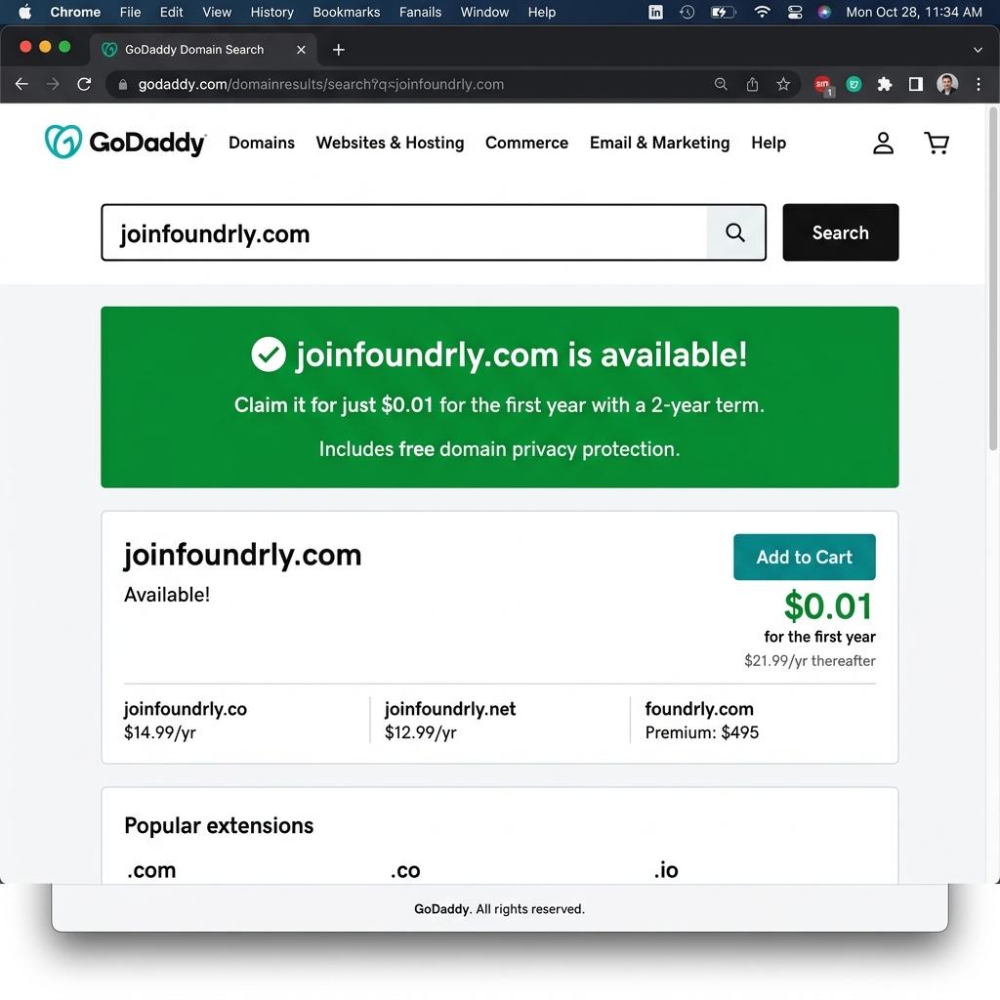

# 📋 ÜRÜN GELİŞTİRME PROJESİ — FİKİR ONAY DOKÜMANI

> **Öğrenci Adı Soyadı:** `Nurseli Demir`
> **Öğrenci Numarası:** `22253042`
> **Tarih:** `08/03/2026`

---

## 1. 🏷️ Ürün İsmi

| Alan | Açıklama |
|------|----------|
| **Ürün İsmi** | `Foundrly` |
| **İsmin Anlamı / Hikayesi** | `Foundrly, “Founder” kelimesinden türetilmiş modern ve akılda kalıcı bir marka ismidir. Platformun amacı, proje fikri olan bireylerin ihtiyaç duydukları yeteneklere sahip ekip arkadaşlarını kolayca bulmalarını sağlamaktır. Günümüzde birçok kişi iyi bir proje fikrine sahip olsa da doğru insanlarla bir araya gelemediği için projeler ya hiç başlamamakta ya da potansiyeline ulaşamamaktadır. Foundrly, kullanıcıların sahip oldukları becerileri, ilgi alanlarını ve proje hedeflerini analiz ederek uyumlu ekiplerin oluşmasına yardımcı olur. Hackathonlar, startup girişimleri, üniversite projeleri ve teknoloji yarışmaları gibi ortamlarda ekip kurma sürecini kolaylaştırmayı hedefler.` |
| **Slogan** | `Turn ideas into teams.` |

---

## 2. 🎨 Ürün Markası

| Alan | Açıklama |
|------|----------|
| **Marka Adı** | `Foundrly` |
| **Marka Kimliği** | `Foundrly; işbirliği, girişimcilik ve üretkenlik değerlerini temsil eden modern bir teknoloji markasıdır. Platformun temel amacı, farklı yeteneklere sahip bireyleri bir araya getirerek güçlü ekiplerin oluşmasını sağlamaktır. Marka kimliği; birlikte üretme kültürünü, girişimci ruhunu ve yeni fikirlerin hayata geçirilmesini destekleyen dinamik bir topluluk anlayışı üzerine kuruludur.` |
| **Marka Renk Paleti** | `Ana renk: #475DB2 (mat mavi – teknoloji, güven ve inovasyonu temsil eder). Yardımcı renkler: #3FB170 (canlı yeşil – büyüme ve işbirliği), #1B2D49 (koyu lacivert – profesyonellik ve güven hissi).` |
| **Tipografi** | `Inter font ailesi kullanılacaktır. Inter; modern, sade ve yüksek okunabilirliğe sahip bir font olduğu için teknoloji ürünlerinde yaygın olarak tercih edilir ve kullanıcı deneyimini destekler.` |

---

## 3. 🌐 Domain (Alan Adı) Kontrolü

| Alan | Açıklama |
|------|----------|
| **Birincil Domain** | `joinfoundrly.com` |
| **Domain Müsait mi?** | `Evet  — Kontrol tarihi: 08/03/2026` |
| **Kontrol Yapılan Site** | `godaddy.com` |


> 📸 **Ekran Görüntüsü:** Domain müsaitlik kontrolünün ekran görüntüsünü buraya ekleyin veya ayrı dosya olarak teslim edin.
### Domain Kontrol Ekranı



---

## 4. 💰 Paketleme Modeli (Free & Premium)

### 4.1 Free (Ücretsiz) Paket

| Özellik | Açıklama |
|---------|----------|
| **Profil Oluşturma** | `Kullanıcılar platformda kişisel profil oluşturabilir, teknik becerilerini (skills), ilgi alanlarını ve proje deneyimlerini ekleyebilir.` |
| **Proje Paylaşma ve Keşfetme** | `Kullanıcılar proje fikirlerini paylaşabilir ve platformda ekip arayan projeleri inceleyebilir.` |
| **Ekip Başvurusu** | `Kullanıcılar projelere başvurarak ekip kurma sürecine katılabilir ve ekip arkadaşı arayabilir.` |
| **Temel Ekip Eşleşmesi** | `Platform, kullanıcıların becerilerine göre sınırlı sayıda ekip önerisi sunar.` |
| **Kısıtlamalar** | `AI destekli gelişmiş ekip eşleşmesi bulunmaz, kullanıcı profili doğrulanmış (verified) statüsüne sahip olmaz ve projeler platformda öne çıkarılmaz.` |

### 4.2 Premium (Ücretli) Paket

| Özellik | Açıklama |
|---------|----------|
| **Aylık Fiyat** | `$5 / ay` |
| **Yıllık Fiyat** | `$48 / yıl (indirimli)` |
| **Verified Talent Rozeti** | `Premium kullanıcılar platform tarafından doğrulanmış yetenek rozeti alabilir. Bu rozet ekip kuran kişiler için güven oluşturur ve kullanıcının daha fazla davet almasını sağlar.` |
| **AI Team Builder** | `Yapay zeka destekli ekip oluşturma sistemi kullanıcıların becerilerini analiz ederek en uygun ekip üyelerini önerir.` |
| **Proje Görünürlük Artışı** | `Premium kullanıcıların projeleri platformda daha görünür hale gelir ve ana sayfa veya önerilen projeler bölümünde öne çıkar.` |
| **Gelişmiş Ekip Filtreleme** | `Kullanıcılar ekip üyelerini teknoloji, deneyim seviyesi ve proje türüne göre daha detaylı filtreleyebilir.` |
| **Networking Fırsatları** | `Premium kullanıcılar platform içindeki özel topluluk etkinliklerine ve networking fırsatlarına erişebilir.` |
| **Ek Avantajlar** | `Reklamsız kullanım, öncelikli destek ve yeni özelliklere erken erişim.` |

### 4.3 Premium Paket Gerekçesi — Neden Bir Kullanıcı Bunun İçin Para Öder?

**Paragraf 1 — Gerçek İhtiyaç Analizi:**

> `Bir proje geliştirme sürecinde en büyük zorluklardan biri doğru ekip arkadaşlarını bulmaktır. Özellikle hackathonlar, startup girişimleri veya üniversite projelerinde ekip kurma süreci çoğu zaman rastgele bağlantılar veya sosyal medya grupları üzerinden yürütülmektedir. Bu yöntemler çoğu zaman zaman kaybına neden olur ve ekip içindeki yetenek dağılımı dengesiz olabilir. Foundrly’nin Premium paketinde sunulan Verified Talent rozeti ve AI Team Builder sistemi bu problemi çözmeyi hedefler. Verified Talent özelliği sayesinde kullanıcıların belirli becerileri doğrulanarak ekip kurmak isteyen kişiler için güven oluşturulur. Örneğin bir kullanıcı makine öğrenmesi projesi için ekip kurmak istediğinde doğrulanmış “ML Engineer” rozetine sahip kişileri tercih edebilir. AI Team Builder sistemi ise kullanıcıların becerilerini ve proje ihtiyaçlarını analiz ederek uygun ekip üyelerini otomatik olarak önerebilir. Ayrıca Premium kullanıcıların projelerinin platformda daha görünür hale gelmesi, daha fazla başvuru almalarını sağlar. Free paket platformu deneyimlemek için yeterlidir ancak gelişmiş eşleşme, doğrulanmış profil ve görünürlük avantajı gibi özellikler yalnızca Premium paket ile sunulduğu için kullanıcıların doğru ekip kurma süreci daha hızlı ve verimli hale gelir.`

**Paragraf 2 — Piyasa Karşılaştırması ve Fiyat Gerekçesi:**

> `Günümüzde ekip arkadaşı bulmak için LinkedIn, Discord toplulukları, Reddit forumları veya çeşitli teknoloji toplulukları kullanılmaktadır. Ancak bu platformlar doğrudan proje bazlı ekip eşleşmesi için tasarlanmamıştır ve kullanıcıların doğru kişilere ulaşması çoğu zaman uzun ve verimsiz bir süreç gerektirir. Örneğin LinkedIn profesyonel ağ kurma amacıyla kullanılmakta olup, proje bazlı ekip eşleşmesi veya yapay zeka destekli ekip önerileri sunmamaktadır. Discord veya forumlar ise genellikle düzensiz iletişim ortamlarıdır ve kullanıcıların becerilerini doğrulayan bir sistem bulunmaz. Foundrly, bu boşluğu doldurarak kullanıcıların becerilerine göre ekip kurmalarını sağlayan ve doğrulanmış yetenek rozetleri ile güven oluşturan bir platform sunar. Premium paket ile sunulan yapay zeka destekli ekip önerileri ve proje görünürlük avantajı, kullanıcıların doğru ekip üyelerine daha kısa sürede ulaşmasını sağlar. Aylık 5 dolar gibi düşük bir ücret, kullanıcıların zaman kazanması ve daha güçlü projeler oluşturma ihtimali göz önüne alındığında makul bir fiyatlandırma olarak değerlendirilebilir.`

---

## 5. 📊 Ürün Tanımı ve Problem Çözümü

### 5.1 Ürün Ne İş Yapar?

> Foundrly, proje fikri olan kişilerin doğru ekip arkadaşlarını bulmasını kolaylaştıran bir platformdur. Günümüzde birçok kişi iyi bir proje fikrine sahip olsa da, bu fikri hayata geçirmek için gerekli yeteneklere sahip ekip üyelerini bulmakta zorlanmaktadır. İnsanlar genellikle sosyal medya grupları, forumlar veya arkadaş çevresi üzerinden ekip kurmaya çalışmakta, ancak bu yöntemler çoğu zaman yetersiz kalmaktadır.
> 
> Foundrly bu problemi çözmek için kullanıcıların becerilerini, ilgi alanlarını ve proje hedeflerini analiz ederek ekip kurma sürecini kolaylaştırır. Kullanıcılar platform üzerinde kendi profillerini oluşturabilir, sahip oldukları teknik becerileri ekleyebilir ve proje fikirlerini paylaşabilir. Diğer kullanıcılar bu projeleri inceleyerek ekip üyesi olarak katılabilir.
> 
> Platform ayrıca kullanıcıların becerilerine göre uygun ekip arkadaşlarını önerebilir ve projelerin daha görünür hale gelmesini sağlayabilir. Bu sayede proje sahipleri doğru yeteneklere sahip kişilerle daha hızlı bir şekilde ekip kurabilir. Foundrly’nin temel amacı, insanların yalnızca fikir üretmekle kalmayıp bu fikirleri güçlü ekiplerle birlikte gerçeğe dönüştürebilmelerini sağlamaktır.

Buna ek olarak platformda “Verified Collaboration Feedback” sistemi bulunmaktadır. Bu sistem sayesinde kullanıcılar yalnızca birlikte çalıştıkları ekip arkadaşları hakkında geri bildirim bırakabilir. Değerlendirmeler iletişim, takım çalışması, güvenilirlik ve teknik yetkinlik gibi kriterler üzerinden puanlama şeklinde yapılır.

Bu özellik sayesinde kullanıcılar ekip arkadaşı seçerken yalnızca profil bilgilerine değil, geçmiş işbirliği deneyimlerine de bakarak daha bilinçli karar verebilir. Böylece platform içerisinde güvenilirlik artar ve daha sağlıklı ekiplerin oluşması sağlanır.

### 5.2 Kullanıcı Persona

> Ayşe, 22 yaşında bir bilgisayar mühendisliği öğrencisidir. Üniversitede aldığı dersler ve katıldığı teknoloji etkinlikleri sayesinde birçok proje fikri geliştirmiştir. Ancak bu projeleri hayata geçirmek için tasarımcı, backend geliştirici veya veri bilimci gibi farklı yeteneklere sahip ekip arkadaşlarına ihtiyaç duymaktadır.
> 
> Ayşe genellikle ekip arkadaşı bulmak için sosyal medya gruplarını veya arkadaş çevresini kullanmaktadır. Ancak bu yöntemler çoğu zaman verimsiz olmakta ve doğru yeteneklere sahip kişileri bulmak zorlaşmaktadır.
> 
> Ayşe Foundrly platformunu kullanarak kendi profilini oluşturur ve sahip olduğu becerileri ekler. Daha sonra proje fikrini platformda paylaşır ve ekip arkadaşı aramaya başlar. Platformun öneri sistemi sayesinde Ayşe, projesi için uygun becerilere sahip kullanıcıları kolayca bulabilir. Böylece Ayşe kısa sürede bir ekip kurarak projesini geliştirmeye başlayabilir.

---

## 6. 🛠️ Teknolojik Altyapı

> ⚠️ **Bu bölümde her alan için yalnızca tek bir teknoloji belirtilmelidir.** "X veya Y" şeklinde belirsiz ifadeler kabul edilmez. Seçiminizi kesin olarak yapınız.

### 6.1 Backend (Sunucu Tarafı)

| Alan | Seçim | Gerekçe |
|------|-------|---------|
| **Programlama Dili** | `Python` | `Python hızlı geliştirme imkanı sunan ve geniş kütüphane ekosistemine sahip bir programlama dilidir.` |
| **Framework** | `Django` | `Django güçlü güvenlik özellikleri, hazır admin paneli ve kullanıcı yönetim sistemi sayesinde web uygulamalarının hızlı geliştirilmesini sağlar.` |
| **Veritabanı** | `PostgreSQL` | `PostgreSQL güvenilir ve ölçeklenebilir bir ilişkisel veritabanıdır.` |
| **API Mimarisi** | `REST` | `REST mimarisi frontend ve backend arasında standart veri iletişimi sağlar.` |
| **Kimlik Doğrulama** | `JWT` | `JWT kullanıcıların güvenli şekilde kimlik doğrulaması yapmasını sağlar.` |

### 6.2 Frontend (Ön Yüz) — Web

| Alan | Seçim | Gerekçe |
|------|-------|---------|
| **Programlama Dili** | `TypeScript` | `TypeScript tip güvenliği sağlayarak büyük ölçekli web uygulamalarında hata oranını azaltır ve kodun daha sürdürülebilir olmasını sağlar.` |
| **Framework / Kütüphane** | `React` | `React, modern web uygulamaları geliştirmek için en yaygın kullanılan frontend kütüphanelerinden biridir ve component tabanlı yapısı sayesinde karmaşık kullanıcı arayüzlerini yönetmeyi kolaylaştırır.` |
| **CSS Framework** | `Tailwind CSS` | `Tailwind CSS hızlı ve esnek arayüz geliştirmeyi sağlayan modern bir CSS frameworküdür ve responsive tasarımlar oluşturmayı kolaylaştırır.` |
| **State Management** | `React Context` | `Uygulama genelinde kullanıcı bilgisi ve uygulama durumunu yönetmek için basit ve etkili bir çözüm sunar.` |

### 6.3 Mobil Uygulama

| Alan | Seçim | Gerekçe |
|------|-------|---------|
| **Geliştirme Yaklaşımı** | `Native` | `iOS platformuna özel performanslı ve platforma özgü kullanıcı deneyimi sunabilmek için native geliştirme yaklaşımı tercih edilmiştir.` |
| **Teknoloji** | `Swift` | `Swift, Apple tarafından geliştirilen ve iOS uygulamaları için resmi olarak desteklenen modern ve güvenli bir programlama dilidir.` |
| **Desteklenen Platformlar** | `iOS` | `Ürünün ilk versiyonunda geliştirme sürecini daha odaklı ve yönetilebilir tutmak amacıyla yalnızca iOS platformu hedeflenmektedir.` |

### 6.4 DevOps & Altyapı

| Alan | Durum | Açıklama |
|------|-------|----------|
| **Versiyon Kontrolü** | 🔒 Zorunlu | Git |
| **Kod Deposu** | 🔒 Zorunlu | GitHub |
| **Konteynerizasyon** | 🔒 Zorunlu | Docker + Docker Compose |


### 6.5 Mimari Diyagram

```text
           Kullanıcı
              │
              ▼
     Web App (React)
     iOS App (Swift)
              │
              ▼
        REST API
        (Django)
              │
              ▼
        PostgreSQL
           Database
```

## 7. 📱 Instagram Story Tanıtım Görselleri (10 Adet)


| Story No | İçerik / Konu | Açıklama |
|----------|--------------|----------|
| **Story 1** | Teaser / Merak Uyandırma | `Kullanıcıda merak uyandırmak amacıyla “Something big is coming” mesajı verilmiştir. Foundrly platformunun yakında kullanıma sunulacağı ima edilmektedir.` |
| **Story 2** | Problem Tanımı | `Startup fikirleri olan kişilerin doğru ekip arkadaşlarını bulmakta zorlandığını gösteren problem anlatılmıştır.` |
| **Story 3** | Çözüm Tanıtımı | `Foundrly platformunun bu problemi çözerek kullanıcıların doğru co-founder ve ekip arkadaşlarını bulmasını sağladığı anlatılmıştır.` |
| **Story 4** | Öne Çıkan Özellik 1 | `Kullanıcıların platformda kendi founder profilini oluşturabildiği ve yeteneklerini, proje fikirlerini paylaşabildiği mobil arayüz gösterilmiştir.` |
| **Story 5** | Öne Çıkan Özellik 2 | `Kullanıcıların platform üzerinden startup projeleri için ekip arkadaşları keşfedebildiği ve uygun kişilerle bağlantı kurabildiği özellik tanıtılmıştır.` |
| **Story 6** | Öne Çıkan Özellik 3 | `Kullanıcıların alanında deneyimli mentor ve girişimcilerden destek alabileceği mentor bağlantı özelliği gösterilmiştir.` |
| **Story 7** | Free vs Premium Karşılaştırma | `Platformun ücretsiz ve premium paketleri karşılaştırılarak kullanıcıların hangi özellikleri hangi paketlerde kullanabileceği gösterilmiştir.` |
| **Story 8** | Kullanıcı Yorumu / Sosyal Kanıt | `Platformun girişimci topluluğu oluşturma hedefi ve kullanıcıların platformdan elde edebileceği değer vurgulanmıştır.` |
| **Story 9** | Nasıl Başlarım? (CTA) | `Kullanıcıların Foundrly platformuna nasıl katılabileceği ve mobil uygulama üzerinden hesap oluşturabileceği gösterilmiştir.` |
| **Story 10** | Lansman / Son Çağrı | `Kullanıcıları uygulamayı indirmeye davet eden “Download Foundrly and start building today” mesajı ve QR/App Store yönlendirmesi gösterilmiştir.` |


---

## 8. 🎨 Logo Tasarımı

| Alan | Açıklama |
|------|----------|
| **Logo Tipi** | `Kombinasyon` |
| **Ana Renk(ler)** | `#475DB2 (mat mavi – teknoloji ve inovasyon), #3FB170 (canlı yeşil – işbirliği ve büyüme), #1B2D49 (koyu lacivert – profesyonellik ve güven)` |
| **Font** | `Inter Bold` |
| **İlham Kaynağı** | `Logo, insanların ve fikirlerin bir araya gelerek yeni projeler üretmesini temsil eden bağlantı noktalarından (network nodes) oluşan minimalist bir sembol içerir. Bu sembol girişimcilerin, geliştiricilerin ve proje ekiplerinin bir platformda buluşmasını simgeler. Minimal tipografi kullanımı ise modern teknoloji ürünlerine uygun profesyonel ve sade bir marka kimliği oluşturmayı amaçlar.` |
| **Kullanım Alanları** | `Web sitesi, mobil uygulama arayüzü, sosyal medya hesapları, tanıtım görselleri ve dijital pazarlama materyalleri` |

### Teslim Edilecek Logo Formatları:

- [x] PNG (şeffaf arka plan)  
  *Görüntüle: [logo.png](./logo/logo.png)*
- [x] Koyu arka plan versiyonu  
  *Görüntüle: [logo-dark.png](./logo/logo-dark.png)*
- [x] Açık arka plan versiyonu  
  *Görüntüle: [logo-light.png](./logo/logo-light.png)*
- [x] Favicon (32x32 px)  
  *Görüntüle: [favicon.png](./logo/favicon.png)*

---

## 9. 📲 Platform Desteği

| Platform | Planlanan | Teknoloji | Açıklama |
|----------|-----------|-----------|----------|
| **Web Uygulaması** | `Evet (Landing Only)` | `React` | `Web versiyonu temel olarak ürün tanıtımı, özellikler, pricing ve uygulama indirme yönlendirmesi için kullanılacaktır. Responsive tasarım ile mobil uyumlu olacak ancak ana kullanım mobil uygulama üzerinden yapılacaktır.` |
| **iOS Uygulaması** | `Evet` | `Swift / SwiftUI` | `Foundrly’nin ana platformu iOS olacaktır. Kullanıcılar App Store üzerinden uygulamayı indirerek hesap oluşturabilecek, co-founder keşfi, mentor bağlantısı ve mesajlaşma özelliklerini kullanabilecektir.` |
| **Android Uygulaması** | `Hayır` | `-` | `İlk aşamada planlanmıyor.` | 
| **Tablet Desteği** | `Hayır` | `-` | `İlk aşamada planlanmıyor.` | 

---


